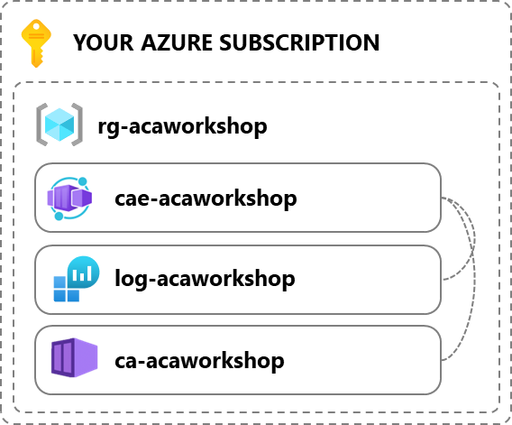
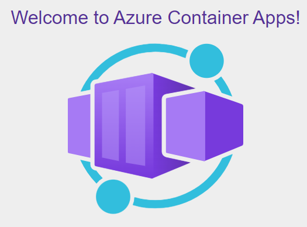

# Lab 1: My first container app

In this lab we'll create a container app in the simplest way possible so you get the chance to explore the possibilities of Azure Container Apps.

> This lab is a very basic introduction of an Azure Container App running 1 container. If you've already seen something of Azure Container Apps, skip to Lab 2 to deploy an actual app with 3 containers using Infrastructure as code.

## 1. Creating a Azure Container App Environment

Use [the Azure Portal](https://portal.azure.com/#view/HubsExtension/BrowseResource/resourceType/Microsoft.App%2FcontainerApps) to create an Azure Container App Environment containing a single Azure Container App. So go ahead and create your first App. Name the resources however you like, but the official prefixes can be seen in the image below.

If you want you can also use [the command line](https://learn.microsoft.com/en-us/azure/container-apps/get-started), but that won't give you as much insight into the different options you have.

Some tips:

> Tip: You can't create the Environment in this way, you need to create an App and create the Environment in one of the first steps.

> Tip: Want to know how to prefix other Azure resources? Have a look at [the Microsoft docs](https://learn.microsoft.com/en-us/azure/cloud-adoption-framework/ready/azure-best-practices/resource-abbreviations)

Some interesting things to notice:

- Zone redundancy is an option if you need more reliability. For this assignment you can leave it disabled, but as you can see you cannot enable it afterwards without recreating the entire environment.
- In the Monitoring tab you have to link to a Log Analytics workspace. It won't only contain your application logs, but also logs about the environment which you will need when doing more than this simple demo.
- Virtual Network integration is an option as well, enabling options for securing your Container Apps. Just as with the Zone redundancy, you can't configure this afterwards so be aware if you'd do this for real as you need to recreate the entire environment. And even when enabling the integration, changing the Virtual IP setting is not possible afterwards. Just as with the Zone redundancy, leave it disabled for now.

## 2. Explore the created Azure Container App

What you just created is an Azure Container App Environment, containing a single Container App. It has one Revision that consist of 0 to 10 Replicas. Each Replica will start a single container image: azuredocs/containerapps-helloworld.

Open the app in the Azure portal and click the URL on the top right. It should provide you with a nice welcome screen. Then have a look around what else you can see in the Portal.
Some interesting things to notice:

- Default scaling is set from 0 to 10, but there is no scaling rule. By default an app will scale based on the number of concurrent HTTP request.
- You can't reach the app by accessing the IP address of the environment. Some magic routing is happening here based on the URL.

