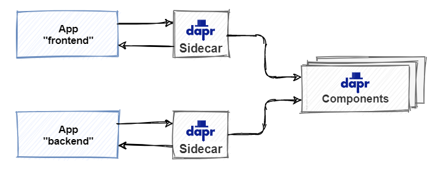
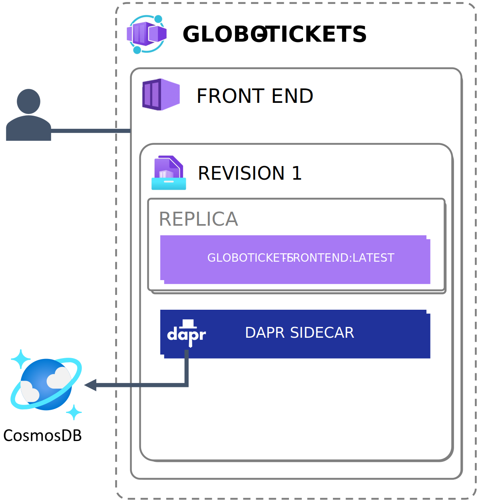
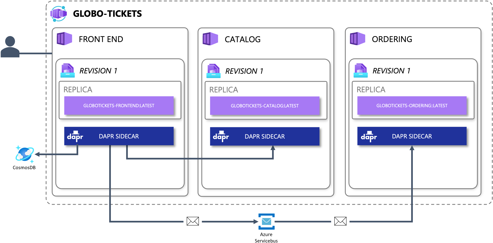

# Lab 5: Adding Dapr to Globo Tickets

The Distributed Application Runtime (Dapr) provides APIs that simplify microservice connectivity. Instead of using the APIs of many different technologies, you are using a single set of generic Dapr APIs and the underlying Dapr components (which is just configuration) take care of the specifics for you. This allows you to run your code locally as well as in the cloud without any changes to your code or conditions in them. In this lab, Dapr will be used for

- Storing state
- Sending and receiving messages
- Exposing secrets to Dapr components

When you use Dapr, each of your applications will have a sidecar. Your app will talk to that Dapr sidecar through a set of APIs in the form of a NuGet package.
The sidecar has access to [Dapr components](https://docs.dapr.io/concepts/components-concept/) you configure.



In this lab you'll learn:

- How to install Dapr
- Different ways to launch the Dapr sidecar locally
- How to use the Dapr in an application
- How to deploy to Azure Container Apps

It will not be a complete lab on everything Dapr has to offer, as that is an entire workshop by itself.

Tip: If you want, you can start with the Azure Container Apps part as that will make use of container images that are provided for you.

## Installing Dapr

First thing you need to do is install the Dapr CLI:

- [Windows](https://docs.dapr.io/getting-started/install-dapr-cli/#tabs-2-windows)
- [Linux](https://docs.dapr.io/getting-started/install-dapr-cli/#tabs-2-linux)

Then make sure to initialize Dapr on your machine. This will spin up some Docker images and create some corresponding Dapr components for you that are used by default if you don't configure your sidecar later on.

- [Initializing Dapr](https://docs.dapr.io/getting-started/install-dapr-selfhost/)

Finally make sure to use the 'src/globo-tickets-dapr' sources for this lab.

## Running an application with the Dapr sidecar locally

There are multiple ways to start the Dapr sidecar together with your application:

- Manually from the CLI
- Automatically with a launch profile
- Automatically by using Docker compose
- Automatically by writing custom code that launches a process on startup

### Starting the Dapr sidecar from the CLI

The best way to understand what is going on, is to use a commandline interface and start the Dapr sidecar manually. It's not very user friendly, but that is not the goal here. Execute the following command:

`dapr run --app-id frontend --dapr-http-port 3500 --app-port 5266`

It should tell you that you're up and running and that the sidecar is listening on port 3500 and is waiting until an app is listening on port 5266. If you start the Frontend project it should discover the app (update the port if your app doesn't start at 5266). Try this!

The frontend itself won't work properly, it can't reach the sidecar because it's using the wrong port (defaults to 50001), the other services aren't running and we're still missing some Dapr components. In the next steps we'll fix these problems.

### Starting the app together with the sidecar

Stop the app and notice the sidecar doesn't detect this. It also won't work anymore if you then start the app again. You need to stop the sidecar and start it again, which is annoying when developing an application. If you want you can start and stop an application together with the Dapr sidecar like this:

`dapr run --app-id frontend --dapr-http-port 3500 --app-port 5266 -- dotnet run`

When executed from the directory containing the csproj, this will also start the frontend. This time the application does know on which port the sidecar started and you should get a different exception, something with 'state store shopstate is not found'. Lets fix that one too.

### Loading the right components

`dapr run --app-id frontend --dapr-http-port 3500 --app-port 5266 --components-path "..\components\docker-compose" -- dotnet run`

What this does, is configure the Dapr sidecar to not load components from the [default directory](https://docs.dapr.io/getting-started/install-dapr-selfhost/#step-5-verify-components-directory-has-been-initialized) but from our own directory. Have a look inside that directory and examine the 'statestore.yaml', compare it to the default 'statestore.yaml' that was loaded by the previous commands.

### Accessing the other services

The last exception should be an Internal Server Error in the HttpClientExtension class, because the Dapr sidecar can't reach the Catalog service. Open up a new terminal and run the following command from the Catalog directory. Notice the different Dapr HTTP port (each app has its own sidecar) and of course different app port.

`dapr run --app-id catalog --dapr-http-port 3501 --app-port 5016 --components-path "..\components\docker-compose" -- dotnet run`

Reload the frontend and it should give you a list of concerts. You can't order anything because the Ordering service isn't running. You get the idea, you could repeat the previous step but we'll show you how to do this the easy way further on.

By starting your app like this, if you want to debug, you need to attach a debugger manually which quickly becomes really annoying. Also the starting/stopping of sidecars is a pain, so we don't recommend working like this.

### Some alternatives

Of course you can combine the things you just learned with some extensions and features of your IDE and make life a lot easier, but the easiest way to spin up multiple applications is by using Docker compose. The next bit is just for your information, continue with the 'Using Docker compose' part next.

In Visual Studio you can make use of launch profiles in combination with the [Child Process Debugging PowerTool extension](https://marketplace.visualstudio.com/items?itemName=vsdbgplat.MicrosoftChildProcessDebuggingPowerTool) to automatically attach the debugger.

```yaml
"Dapr": {
      "commandName": "Executable",
      "environmentVariables": {
        "ASPNETCORE_ENVIRONMENT": "Development"
      },
      "workingDirectory": "$(ProjectDir)",
      "executablePath": "dapr",
      "commandLineArgs": "run --app-id frontend --dapr-http-port 3500 --app-port 5266 --components-path ..\\components\\docker-compose -- dotnet run"
}
```

In Visual Studio Code you can make use of the Dapr extension and [launch configurations](https://docs.dapr.io/developing-applications/ides/vscode/vscode-how-to-debug-multiple-dapr-apps/)

## Using Docker compose

First thing you need to do is make sure you can start Globotickets locally and that the frontend and both services all have their own Dapr sidecar.

## Dapr

Add state store component & switch implementation

    
    
Add pubsub component & switch implementation

    

Add secret store & update components

    - secret store

## Deploying to Azure Container Apps

  - app insights instrumentation key -> application map
  

  -
